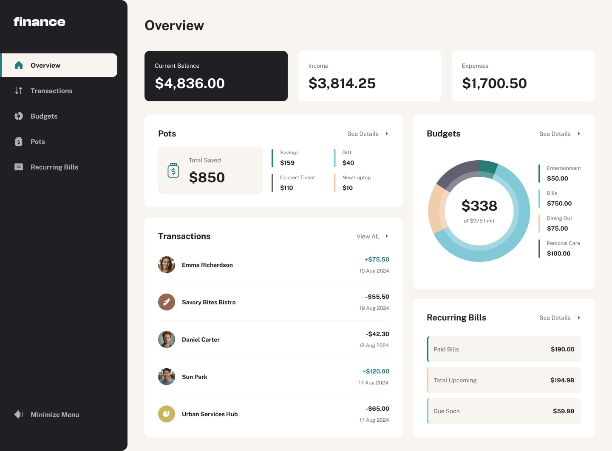

# Personal Finance App

A modern web application for managing personal finances, built with React and Tailwind CSS.



## Features

- Transaction Management
  - View all transactions
  - Filter by category
  - Search transactions
  - Sort by date and amount
- Responsive Design
  - Mobile-friendly interface
  - Clean and modern UI
- Pagination
  - Easy navigation through transactions
  - Customizable items per page

## Technologies Used

- React
- Tailwind CSS
- Lucide Icons
- React Router (if implemented)

## Getting Started

1. Clone the repository

```bash
git clone https://github.com/Hanan1413/personal-finance-app.git
```

2. Install dependencies

```bash
npm install
```

3. Start the development server

```bash
npm run dev
```

4. Open [http://localhost:3000](http://localhost:3000) to view it in your browser.

## Project Structure

```
src/
  ├── components/
  │   ├── Pagination/
  │   ├── Search/
  │   ├── Sort/
  │   └── Transactions/
  ├── App.jsx
  └── main.jsx
```

## Contributing

Feel free to submit issues and enhancement requests.

## License

This project is licensed under the MIT License.
